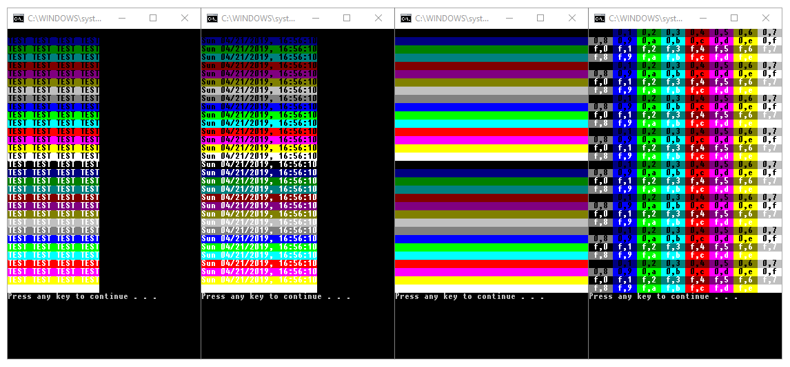

	<b>Echo Color</b>
	 
	<i>Simple and easy to use color plugin for batch scripts.</i>
	   
	

# Syntax

    call echocl.bat "string" newline fgcolor bgcolor

Syntax examples:

    call echocl.bat "TEST #1" y c 4
    call echocl.bat "TEST #2" y 0 e
    call echocl.bat "TEST #3" n 1
    call echocl.bat "TEST #3" n a
    
# Example files
Run by double-click:
> src/example1.bat

> src/example2.bat

# Note
Make sure you have disabled **legacy console**.
